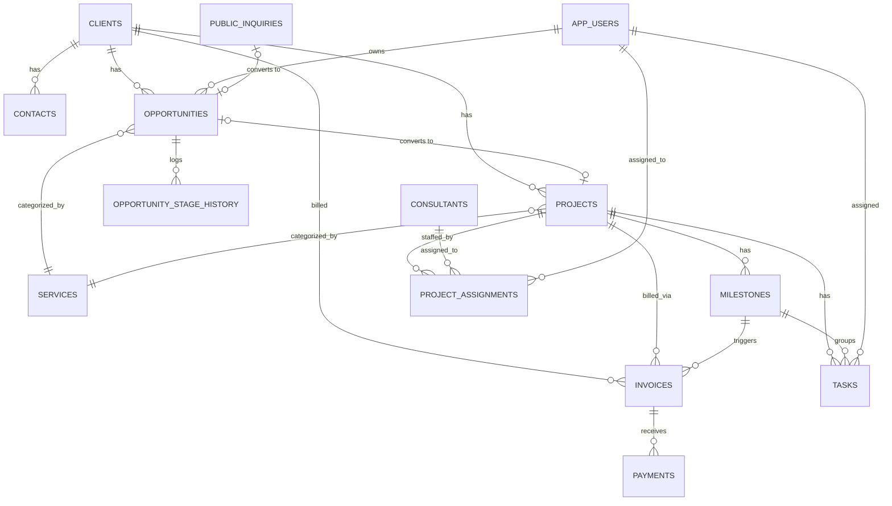

# TECH_DESIGN.md — Strategnosis Growth and Delivery Hub

Phase 3 deliverable. Assumes SPEC.md scope (§4.1) as the build target.

---

## 1. Stack evaluation (before committing — per your brief's own instruction not to use a
stack blindly)

The brief suggested Next.js + TypeScript + Tailwind + Supabase + Vercel. I'm keeping most of
it but changing **how** Next.js is used and **where** it's hosted, for a concrete reason:

**The problem with the literal suggestion:** Vercel's free "Hobby" tier terms restrict it to
non-commercial use. Strategnosis is a registered OPC — running production business software
on it is a real (if commonly ignored) ToS gray area, not a hypothetical. You asked for free
hosting, so I want the free option to actually be clean.

**What I'm recommending instead:**
- **Next.js in static-export mode** (`output: 'export'`) instead of server-rendered/serverless
  Next.js. The app doesn't need server-side rendering — it's a login-gated internal tool plus
  one public marketing page. Static export produces plain HTML/JS/CSS with no server process,
  and Supabase's client-side SDK + Row-Level Security (RLS) handles auth and data access
  directly from the browser — this is Supabase's standard supported pattern, not a workaround.
- **Cloudflare Pages** instead of Vercel for hosting. Free tier, unlimited requests/bandwidth,
  and its terms explicitly permit commercial use. Deploys straight from GitHub on push.
- **Supabase** (Postgres + Auth + Storage) stays — it's the right fit here specifically
  because your data is inherently relational (clients → opportunities → projects → tasks →
  invoices, all joined and filtered together); a NoSQL option like Firebase would fight that
  shape. Free tier covers this scale.

**Cost at MVP scale: $0/month.** Real constraints to know about, not hide:
- Supabase free-tier projects pause after 7 days with zero API activity (a public site with
  even occasional visitors avoids this in practice; worst case, one login unpauses it).
- Supabase free tier has **no vendor-managed backups** — see §9 for the mitigation.
- When the business outgrows free tier (more storage, need for guaranteed backups), Supabase
  Pro is ~$25/month. That's the first real cost this system will ever ask for, and only when
  usage justifies it.

**Maintenance:** no server to patch or restart — it's static files + a managed Postgres
instance. The core team member you confirmed as "okay with basic admin" can handle everything
here: Supabase dashboard for user management, Cloudflare Pages dashboard for deploy status.

**Vendor lock-in:** low-moderate. Supabase is hosted Postgres with a few extensions — a
`pg_dump` gets you a portable database at any time (see §9). Auth and Storage integration
would need rework if you ever migrated providers, but that's a bounded, known cost, not a
trap.

## 2. Architecture Overview

```
Browser (React SPA, statically hosted)
   │
   ├── Supabase Auth (Google OAuth / email+password)
   ├── Supabase Postgres (PostgREST auto-API, RLS-enforced)
   ├── Supabase Storage (uploaded documents)
   └── Supabase Postgres RPC functions (atomic multi-table operations)

Public landing page: same static bundle, unauthenticated routes,
inquiry form → anon INSERT into `public_inquiries` (staging table, not the live pipeline)

Deploy: GitHub repo → Cloudflare Pages (auto-build on push to main)
```

No custom backend server. All business logic that must be atomic (won→project conversion,
payment recording) lives in Postgres functions, not client-side JS — so it can't be bypassed
by a malformed request.

## 3. Database Schema (v1)

Enums are Postgres `check` constraints for simplicity (avoids ALTER TYPE friction early on).

```sql
-- users mirrors auth.users, extended with app role
create table app_users (
  id uuid primary key references auth.users(id),
  full_name text not null,
  email text not null,
  role text not null check (role in ('owner','core_team','temp_consultant')),
  active boolean not null default true,
  created_at timestamptz not null default now()
);

create table clients (
  id uuid primary key default gen_random_uuid(),
  org_name text not null,
  org_type text,
  sector text,
  address text,
  website text,
  main_contact_id uuid, -- set after contacts insert, nullable
  preferred_channel text,
  source text,
  relationship_owner uuid references app_users(id),
  status text not null default 'prospect'
    check (status in ('prospect','active_client','previous_client','strategic_partner','dormant','do_not_pursue')),
  notes text,
  created_by uuid references app_users(id),
  updated_by uuid references app_users(id),
  created_at timestamptz not null default now(),
  updated_at timestamptz not null default now()
);

create table contacts (
  id uuid primary key default gen_random_uuid(),
  client_id uuid not null references clients(id) on delete cascade,
  name text not null,
  position text,
  email text,
  phone text,
  is_primary boolean not null default false,
  notes text,
  created_at timestamptz not null default now()
);

create table services (
  id uuid primary key default gen_random_uuid(),
  name text not null,
  category text not null,
  description text,
  active boolean not null default true
);

create table opportunities (
  id uuid primary key default gen_random_uuid(),
  title text not null,
  client_id uuid not null references clients(id),
  contact_id uuid references contacts(id),
  service_id uuid references services(id),
  description text,
  source text,
  date_received date not null default current_date,
  estimated_value numeric(14,2),
  currency text not null default 'PHP',
  probability_pct integer not null default 10 check (probability_pct between 0 and 100),
  weighted_value numeric(14,2) generated always as
    (coalesce(estimated_value,0) * probability_pct / 100.0) stored,
  expected_decision_date date,
  expected_start_date date,
  proposal_deadline date,
  owner_id uuid not null references app_users(id),
  stage text not null default 'new_inquiry' check (stage in (
    'new_inquiry','initial_contact','qualification','discovery','preparing_proposal',
    'proposal_submitted','under_evaluation','negotiation','awaiting_approval',
    'won','lost','on_hold')),
  next_action text,
  next_action_due date,
  proposal_file_link text,
  proposal_status text,
  proposal_submitted_date date,
  competitors text,
  client_budget numeric(14,2),
  terms_of_reference_link text,
  notes text,
  reason_won text,
  reason_lost text,
  reason_delayed text,
  last_activity_at timestamptz not null default now(),
  created_by uuid references app_users(id),
  updated_by uuid references app_users(id),
  created_at timestamptz not null default now(),
  updated_at timestamptz not null default now()
);

create table opportunity_stage_history (
  id uuid primary key default gen_random_uuid(),
  opportunity_id uuid not null references opportunities(id) on delete cascade,
  from_stage text,
  to_stage text not null,
  changed_by uuid references app_users(id),
  changed_at timestamptz not null default now(),
  note text
);

create table projects (
  id uuid primary key default gen_random_uuid(),
  name text not null,
  client_id uuid not null references clients(id),
  opportunity_id uuid references opportunities(id),
  contract_reference text,
  description text,
  service_id uuid references services(id),
  project_manager_id uuid references app_users(id),
  start_date date,
  end_date date,
  contract_amount numeric(14,2),
  currency text not null default 'PHP',
  status text not null default 'mobilization' check (status in (
    'mobilization','in_progress','awaiting_client_input','under_client_review',
    'revision','on_hold','completed','closed','cancelled')),
  health_status text not null default 'gray' check (health_status in ('green','amber','red','gray')),
  notes text,
  closeout_notes text,
  created_by uuid references app_users(id),
  updated_by uuid references app_users(id),
  created_at timestamptz not null default now(),
  updated_at timestamptz not null default now()
);

create table milestones (
  id uuid primary key default gen_random_uuid(),
  project_id uuid not null references projects(id) on delete cascade,
  title text not null,
  description text,
  responsible_id uuid references app_users(id),
  planned_start date,
  due_date date,
  actual_completion_date date,
  status text not null default 'not_started' check (status in (
    'not_started','in_progress','for_review','awaiting_client','completed','deferred','cancelled')),
  completion_pct integer not null default 0 check (completion_pct between 0 and 100),
  client_acceptance_required boolean not null default false,
  client_acceptance_date date,
  billing_trigger boolean not null default false,
  comments text
);

create table tasks (
  id uuid primary key default gen_random_uuid(),
  project_id uuid not null references projects(id) on delete cascade,
  milestone_id uuid references milestones(id),
  title text not null,
  assigned_to uuid references app_users(id),
  priority text not null default 'medium' check (priority in ('low','medium','high','urgent')),
  start_date date,
  due_date date,
  status text not null default 'not_started' check (status in (
    'not_started','in_progress','for_review','awaiting_client','completed','deferred','cancelled')),
  estimated_effort numeric(6,1),
  actual_effort numeric(6,1),
  comments text,
  created_by uuid references app_users(id),
  created_at timestamptz not null default now(),
  updated_at timestamptz not null default now()
);

create table consultants (
  id uuid primary key default gen_random_uuid(),
  full_name text not null,
  title text,
  expertise text[],
  service_categories text[],
  contact_email text,
  contact_phone text,
  rate numeric(12,2),           -- sensitive; see §7 authorization matrix
  rate_currency text default 'PHP',
  availability text,
  location text,
  travel_availability boolean default false,
  performance_notes text,        -- sensitive
  conflict_of_interest_notes text,
  active boolean not null default true,
  linked_user_id uuid references app_users(id),
  created_at timestamptz not null default now(),
  updated_at timestamptz not null default now()
);

create table project_assignments (
  id uuid primary key default gen_random_uuid(),
  project_id uuid not null references projects(id) on delete cascade,
  consultant_id uuid references consultants(id),
  user_id uuid references app_users(id),
  role_on_project text,
  start_date date,
  end_date date,
  notes text,
  check (consultant_id is not null or user_id is not null)
);

create table invoices (
  id uuid primary key default gen_random_uuid(),
  invoice_ref text not null,
  client_id uuid not null references clients(id),
  project_id uuid not null references projects(id),
  milestone_id uuid references milestones(id),
  invoice_date date not null default current_date,
  due_date date,
  amount numeric(14,2) not null,
  currency text not null default 'PHP',
  tax_note text,
  status text not null default 'draft' check (status in (
    'draft','for_submission','submitted','partially_paid','paid','overdue','cancelled')),
  invoice_file_link text,
  follow_up_notes text,
  created_by uuid references app_users(id),
  created_at timestamptz not null default now(),
  updated_at timestamptz not null default now()
);

create table payments (
  id uuid primary key default gen_random_uuid(),
  invoice_id uuid not null references invoices(id) on delete cascade,
  payment_date date not null default current_date,
  amount numeric(14,2) not null,
  method text,
  receipt_link text,
  notes text,
  created_by uuid references app_users(id),
  created_at timestamptz not null default now()
);

create table documents (
  id uuid primary key default gen_random_uuid(),
  label text not null,
  category text,
  storage_path text,      -- Supabase Storage object path, nullable
  external_link text,     -- Google Drive etc., nullable
  linked_entity_type text not null check (linked_entity_type in (
    'client','opportunity','project','task','consultant','invoice')),
  linked_entity_id uuid not null,
  uploaded_by uuid references app_users(id),
  created_at timestamptz not null default now(),
  check (storage_path is not null or external_link is not null)
);

create table public_inquiries (
  id uuid primary key default gen_random_uuid(),
  name text not null,
  organization text,
  email text not null,
  phone text,
  message text,
  service_interest text,
  submitted_at timestamptz not null default now(),
  opportunity_id uuid references opportunities(id),
  status text not null default 'new' check (status in ('new','converted','spam'))
);
```

A trigger keeps `projects.completion_pct` (a derived column, not shown above for brevity) in
sync whenever a milestone's `completion_pct` changes — average of milestone completion,
weighted equally. `opportunities.last_activity_at` is bumped by a trigger on any update, and a
scheduled query flags rows where `now() - last_activity_at > 14 days` for the dashboard's
"stale opportunity" flag.

## 4. Entity-Relationship Diagram



## 5. Navigation Map

**Public site** (unauthenticated, `/`): single-page — hero/overview → service categories →
principal profile (public-safe subset only) → inquiry form → privacy notice footer. Submits to
`public_inquiries`.

**App** (authenticated, `/app/*`):
```
/app/dashboard                 (role-aware: full for owner/core, "my tasks" only for temp)
/app/clients            /app/clients/:id
/app/opportunities       (pipeline board, drag between stages)  /app/opportunities/:id
/app/projects            /app/projects/:id  (tabs: overview, milestones, tasks, team, documents, billing)
/app/tasks                (cross-project "my work" view + workload view for owner/core)
/app/consultants          /app/consultants/:id
/app/invoices             /app/invoices/:id
/app/settings             (users, service catalogue — owner only)
/app/login
```
Temp consultants only ever see `/app/dashboard` (their tasks) and the specific
`/app/projects/:id` they're assigned to, read-only except their own task status.

## 6. Wireframe Descriptions

- **Dashboard**: top row of 4 stat tiles (pipeline value, active projects, overdue tasks,
  outstanding receivables), then two columns — "Needs your attention" (overdue/at-risk items,
  red/amber) and "Coming up" (next 7/30 days). No charts in v1; numbers and lists only, per
  your "avoid clutter" requirement.
- **Opportunity Pipeline**: Kanban board, one column per stage, cards show client, value,
  next-action due date (red if overdue). List-view toggle for filtering/search.
- **Project Detail**: header with status/health badge, tabs for Milestones (checklist with
  progress bars), Tasks (grouped by assignee), Team, Documents (links + uploads), Billing
  (milestones due, invoices, balance).
- **Task view**: simple list grouped by "overdue / this week / later", filterable by project
  or assignee.

(I can render clickable mockups for any of these on request — flagging that's available
rather than producing it speculatively.)

## 7. Authorization Matrix (enforced via Postgres RLS, not UI-only)

| Table | owner | core_team | temp_consultant |
|---|---|---|---|
| clients, contacts, opportunities, opportunity_stage_history | full CRUD | full CRUD | no access |
| projects, milestones | full CRUD | full CRUD | SELECT where own `project_assignments` row exists |
| tasks | full CRUD | full CRUD | SELECT/UPDATE own tasks only (via assigned_to = auth.uid()) |
| consultants (rate, performance_notes columns) | full | full (confirmed both roles trusted at this team size) | own row only, sensitive columns excluded via view |
| invoices, payments | full CRUD | full CRUD | no access |
| documents | full CRUD | full CRUD | SELECT where linked_entity is a project they're assigned to |
| public_inquiries | full | full | no access |
| app_users | full (incl. role changes) | SELECT all, update own profile | SELECT own row only |

Column-level restriction on `consultants.rate`/`performance_notes` for temp consultants is
done via a `consultants_own_profile` view (excludes those columns) rather than raw table RLS,
since Postgres RLS is row-level not column-level.

## 8. Authentication Design

Supabase Auth. Google OAuth as primary sign-in (matches your Gmail-based workflow), email +
password as fallback for anyone without Google. New users are created inactive by default;
the owner activates and assigns a role from `/app/settings/users` — nobody self-assigns a
role. Session handled entirely by Supabase's client SDK (JWT in local storage, auto-refresh);
no server-side session store needed since there's no server.

## 9. File Storage Approach

Supabase Storage bucket `documents`, private by default, access brokered through signed URLs
generated on demand (RLS on the `documents` table decides who can request a signed URL, not
bucket-level public access). Every document row can instead hold an `external_link` (Google
Drive, etc.) if the team prefers not to upload — both paths coexist per your answer to Q7.

## 10. Error Handling Approach

- Postgres constraints (NOT NULL, CHECK, FK) are the source of truth for data validity — the
  UI validates the same rules client-side (via a shared Zod schema) purely for fast feedback,
  never as the only guard.
- Common Postgres error codes are mapped to plain-language toasts (23505 → "That already
  exists", 23503 → "That record was removed by someone else — refresh and try again").
- A top-level React error boundary catches unexpected exceptions and shows a plain "something
  went wrong" screen with a retry action, instead of a blank page.

## 11. Backup & Export Approach

Supabase's **free tier has no automatic backups** — this is a real gap, not glossed over.
Mitigation for v1: an owner-triggered "Export all data" action in `/app/settings` that runs a
`pg_dump`-equivalent (via Supabase's REST/CLI) and downloads a dated `.sql` + CSV bundle,
recommended weekly, saved to the team's own Google Drive. This satisfies the brief's "regular
backup guidance" and "data export" requirements without paid infrastructure. Revisit Supabase
Pro (~$25/mo, includes point-in-time recovery) once the business is generating enough
recurring revenue that data loss risk outweighs the cost.

## 12. Deployment Plan

1. Private GitHub repo; Supabase CLI migrations checked in under `/supabase/migrations`.
2. Supabase project (free tier) for Postgres/Auth/Storage; RLS policies applied via migration,
   never edited ad hoc in the dashboard so they stay reproducible.
3. Cloudflare Pages connected to the GitHub repo; build command `next build` with static
   export; auto-deploys `main` on push, preview deploys on PRs.
4. Environment variables (`NEXT_PUBLIC_SUPABASE_URL`, `NEXT_PUBLIC_SUPABASE_ANON_KEY` — the
   anon key is safe to ship client-side by design; the service-role key is never used in this
   app) set in Cloudflare Pages project settings.
5. Custom domain attachable later at no extra cost once you have one.

---

Next up (Phase 4) is implementation: repo scaffold, migrations, seed data, auth, and the core
modules in the priority order from SPEC.md §4.1. Confirm this design (or flag anything —
especially the Cloudflare Pages/static-export change from the brief's literal Vercel
suggestion) and I'll start building.
